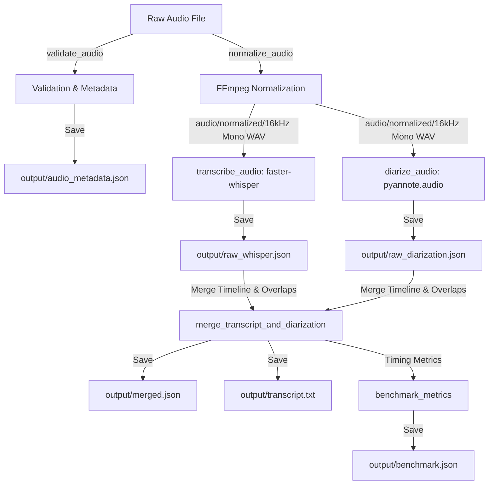

# Local Speech-to-Text & Speaker Diarization Pipeline

A production-ready, fully local application for validating, normalizing, transcribing, and diarizing audio recordings. It merges speech-to-text segments with speaker timelines and outputs a timestamped readable transcript, alongside detailed benchmarking and metadata reports.

---

## Architecture Diagram



---

## Folder Explanation

```text
.
├── src/
│   ├── __init__.py
│   ├── config.py         # Configuration settings loaded from .env
│   ├── logger.py         # Structured pipeline logging (stdout & logs/pipeline.log)
│   ├── registry.py       # Singleton Model Registry (cached Whisper/pyannote pipelines)
│   ├── normalize.py      # Audio validation and FFmpeg normalization
│   ├── transcribe.py     # faster-whisper transcription & confidence check
│   ├── diarize.py        # pyannote.audio speaker diarization & speaker renaming
│   ├── merge.py          # Alignment engine for STT + speaker timelines
│   ├── benchmark.py      # Profiling metrics & Real-Time Factor (RTF) compiler
│   ├── main.py           # Entrypoint: FastAPI web application & CLI routing
│   └── templates/
│       └── index.html    # Developer local web test dashboard (Vanilla CSS & JS)
├── audio/
│   ├── raw/              # Saved copies of uploaded raw files
│   └── normalized/       # FFmpeg-normalized 16kHz mono WAV files
├── output/               # Mandatory pipeline json, txt, and metadata outputs
├── datasets/             # Local folders containing sample audio datasets
├── logs/                 # Folder containing pipeline execution logs
├── tests/                # Comprehensive unit and integration test suite
├── requirements.txt      # Main project requirements file
├── requirements-lock.txt # Frozen packages list for total reproducibility
└── README.md
```

---

## Prerequisites & Installation

### 1. FFmpeg Installation
The audio validation and normalization pipeline calls FFmpeg and FFprobe system commands. Ensure they are installed on your host system:

- **macOS (via Homebrew):**
  ```bash
  brew install ffmpeg
  ```
- **Ubuntu/Linux:**
  ```bash
  sudo apt update
  sudo apt install ffmpeg
  ```

### 2. Hugging Face Access & Setup
`pyannote.audio` speaker diarization models require user agreements to download.
1. Log in or create an account on [Hugging Face Hub](https://huggingface.co/).
2. Accept the terms of service on the following model pages:
   - [pyannote/speaker-diarization-3.1](https://huggingface.co/pyannote/speaker-diarization-3.1)
   - [pyannote/segmentation-3.0](https://huggingface.co/pyannote/segmentation-3.0)
3. Generate an Access Token (Read scope) under your [Hugging Face settings](https://huggingface.co/settings/tokens).
4. Save this token as `HF_TOKEN` in your `.env` file.

### 3. Local Setup
1. Clone the repository and navigate into the folder.
2. Initialize and activate a Python 3.12 or 3.13 virtual environment:
   ```bash
   python3 -m venv .venv
   source .venv/bin/activate
   ```
3. Install pinned dependencies:
   ```bash
   pip install --upgrade pip
   pip install -r requirements.txt
   pip install faster-whisper==1.2.1 --no-deps
   ```
4. Copy the environment variables template and configure your `HF_TOKEN`:
   ```bash
   cp .env.example .env
   ```

---

## Environment Variables

Settings are loaded via `src/config.py` using Pydantic Settings.

| Variable | Default | Description |
| :--- | :--- | :--- |
| `LOG_LEVEL` | `INFO` | Level of logging output (`DEBUG`, `INFO`, `WARNING`, `ERROR`). |
| `WHISPER_MODEL` | `turbo` | Size of Whisper model to use (`small`, `large-v3`, `turbo`). |
| `DEVICE_PREFERENCE` | `mps` | Preferred hardware device accelerator (`cuda`, `mps`, `cpu`). |
| `WHISPER_CONFIDENCE_THRESHOLD`| `0.6` | Whisper segments below this probability are marked `[Low Confidence]`. |
| `HF_TOKEN` | `None` | Your Hugging Face user access token. |
| `MAX_FILE_SIZE_BYTES` | `104857600` | Max file size in bytes (default: 100MB). |
| `MAX_AUDIO_DURATION_SECONDS` | `3600` | Max audio length in seconds (default: 1 hour). |
| `RAW_AUDIO_DIR` | `audio/raw` | Saved location of raw input audio files. |
| `NORMALIZED_AUDIO_DIR` | `audio/normalized`| Saved location of FFmpeg-normalized audio. |
| `OUTPUT_DIR` | `output` | Directory for JSON/TXT pipeline outputs. |

---

## Running the Application

### 1. Command Line Interface (CLI)
You can run the pipeline directly on an audio file from the terminal. This runs independently of FastAPI.
```bash
python -m src.main --audio path/to/your/audio.mp3
```

### 2. FastAPI Web Server & Developer Dashboard
To start the FastAPI web server which serves both the REST API and the local developer test interface:
```bash
uvicorn src.main:app --reload --host 0.0.0.0 --port 8000
```
- Open `http://localhost:8000` in your web browser to access the interactive **Developer Dashboard** (allows file upload, live microphone recording, status updates, results visualizer, and artifact downloads).
- Open `http://localhost:8000/docs` to access the interactive **Swagger API documentation**.

#### API Endpoint: `POST /api/v1/diarize`
Uploads an audio file and returns the merged speaker transcript as JSON.

**Request Body (Multipart Form):**
- `file`: The raw audio file payload (e.g., MP3, WAV, M4A).

**JSON Response Format:**
```json
[
  {
    "speaker": "Speaker 1",
    "start": 0.50,
    "end": 3.20,
    "text": "Hello world.",
    "confidence": 0.98
  },
  {
    "speaker": "Speaker 2",
    "start": 3.20,
    "end": 5.00,
    "text": "[Low Confidence] Garbled background response.",
    "confidence": 0.45
  }
]
```

---

## Output Files Structure

The pipeline generates the following files in the `output/` directory for each run:
- **`audio_metadata.json`**: Extracted codecs, sample rates, duration, and bitrates of the raw file.
- **`raw_whisper.json`**: Complete transcription payload including word-level timestamps.
- **`raw_diarization.json`**: Detected speaker timeline tracks mapped chronologically to sequential labels (`Speaker 1`, `Speaker 2`, etc.).
- **`merged.json`**: Timestamps aligned speech segments.
- **`transcript.txt`**: Formatting of the text transcript including speaker names and timestamps.
- **`benchmark.json`**: Machine specifications, timings for each module, and Real-Time Factor (RTF).

---

## Testing & Quality Assurance

Unit and integration tests are located in the `tests/` directory. The test suite mocks heavy AI models to run instantly.
Run the tests with coverage:
```bash
pytest --cov=src tests/
```

We maintain code quality using Black and Ruff:
```bash
# Format check
black --check src/ tests/

# Linter check
ruff check src/ tests/
```

---

## Troubleshooting

- **PyAV/av Compilation Errors:** On macOS, newer FFmpeg versions (like FFmpeg 7 or 8) might conflict with older PyAV. We bypass this by manually upgrading to `av>=18.0.0` which features prebuilt macOS ARM64 binary wheels.
- **Hugging Face access terms:** If pyannote fails to load, ensure you have accepted the agreements on BOTH [pyannote/speaker-diarization-3.1](https://huggingface.co/pyannote/speaker-diarization-3.1) and [pyannote/segmentation-3.0](https://huggingface.co/pyannote/segmentation-3.0) on Hugging Face, and that your `HF_TOKEN` in `.env` is correct.
- **Apple Silicon (M1/M2/M3) MPS Support:** Torch fully utilizes MPS for pyannote.audio, while CTranslate2 (faster-whisper) executes on the CPU since it doesn't feature an MPS backend. This is handled automatically by the `ModelRegistry`.

---

## Known Compatibility Notes

During production audit and validation, the following library compatibility layers were integrated to support PyTorch 2.6+, NumPy 2.x, and the latest Hugging Face hub configurations:

1. **`huggingface_hub` `use_auth_token` TypeError:**
   * **Symptom:** `TypeError: hf_hub_download() got an unexpected keyword argument 'use_auth_token'` when loading pyannote pipelines.
   * **Fix:** Pinned `huggingface-hub>=0.13,<0.25.0` in dependencies to maintain backward compatibility with legacy parameters required by older `pyannote.audio` builds.

2. **Matplotlib ModuleNotFoundError:**
   * **Symptom:** `ModuleNotFoundError: No module named 'matplotlib'` during diarization loading.
   * **Fix:** Installed `matplotlib` as it is unconditionally imported inside pyannote's core segmentation tasks.

3. **PyTorch 2.6+ strict `weights_only=True` Unpickling Error:**
   * **Symptom:** `_pickle.UnpicklingError: Weights only load failed... Unsupported global: GLOBAL torch.torch_version.TorchVersion was not an allowed global.`
   * **Fix:** Implemented a temporary, thread-safe monkeypatch of `torch.load` during the `from_pretrained` call in `src/registry.py` to bypass `weights_only` restrictions for this trusted HF repository, safely restoring it in a `finally` block.

4. **NumPy 2.x uppercase `np.NAN` AttributeError:**
   * **Symptom:** `AttributeError: module 'numpy' has no attribute 'NAN'` during diarization speaker turns reconstruction.
   * **Fix:** Added a process-wide NumPy compatibility monkeypatch in `src/registry.py` setting `np.NAN = np.nan` and `np.NaN = np.nan` at runtime if missing.

